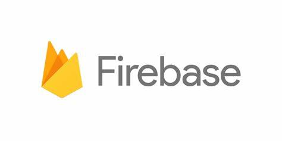

# Introduction

**Meshi Meshi!** is a web-based recipe app that allows users to sift through tons of recipes, save favorites, and check cooking videos. It also lets users know the preparation time, the main ingredients, and the type of meal, which the user wants to make. For the best experience, **Meshi Meshi!** can be used in different platforms such as Android, iOS, & the web.

## Tools

**React JS**  
`React is an open-source, front end, JavaScript library for building user interfaces or UI components. It is maintained by Facebook and a community of individual developers and companies. React can be used as a base in the development of single-page or mobile applications.`

**Google Firebase**  
`Firebase is a platform developed by Google for creating mobile and web applications. In 2014, Google acquired the platform and it is now their flagship offering for app development.`

**Microsoft Azure**  
`Microsoft Azure, commonly referred to as Azure, is a cloud computing service created by Microsoft for building, testing, deploying, and managing applications and services through Microsoft-managed data centers. It provides software as a service, platform as a service and infrastructure as a service and supports many different programming languages, tools, and frameworks, including both Microsoft-specific and third-party software and systems.`

